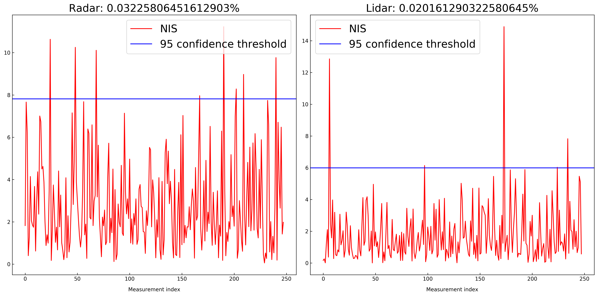

# Unscented Kalman Filter Project
This Project is the seventh task (Project 2 of Term 2) of the Udacity Self-Driving Car Nanodegree program.

The main goal of the project is to apply Unscented Kalman Filter to estimate the state of a moving object of interest with noisy lidar and radar measurements using C++. Passing the project requires obtaining RMSE values that are lower that the tolerance outlined in the project rubric. 

The project was created with the Udacity [Starter Code](https://github.com/udacity/CarND-Unscented-Kalman-Filter-Project).

This project involves the Term 2 Simulator which can be downloaded [here](https://github.com/udacity/self-driving-car-sim/releases)

---

## Other Important Dependencies
* cmake >= 3.5
  * All OSes: [click here for installation instructions](https://cmake.org/install/)
* make >= 4.1 (Linux, Mac), 3.81 (Windows)
  * Linux: make is installed by default on most Linux distros
  * Mac: [install Xcode command line tools to get make](https://developer.apple.com/xcode/features/)
  * Windows: [Click here for installation instructions](http://gnuwin32.sourceforge.net/packages/make.htm)
* gcc/g++ >= 5.4
  * Linux: gcc / g++ is installed by default on most Linux distros
  * Mac: same deal as make - [install Xcode command line tools](https://developer.apple.com/xcode/features/)
  * Windows: recommend using [MinGW](http://www.mingw.org/)

## Basic Build Instructions

1. Clone this repo.
2. Make a build directory: `mkdir build && cd build`
3. Compile: `cmake .. && make`
4. Run it: `./UnscentedKF`. 
5. Run Term 2 Simulator and then `Project 1/2: EKF and UKF`.It will use I/O from the simulator.

---

## Results

In this project, as asked, I used a "constant turn rate and velocity magnitude" (CTRV) process model to carry out the Kalman filter's prediction step.

I implemented the Unscented Kalman Filter and ran with in the simulator.

I outputed the NIS values and then plotted them against the 95% line, chi^2.0.50, being 7.915 for the radar measurements (df=3) and 5.991 for the lidar measurements (df=2) . I reused and improved code by [mcarilli](https://github.com/mcarilli/CarND-Unscented-Kalman-Filter) for that.

I then used the NIS plot to help me tune the process noise standard deviation values for longitudinal and yaw accelerations.

If much more than 5% of the NIS values computed from measurements exceed the threshold, it means the uncertainty of the process noise is underestimated and that the estimations are actually less precise than we think. The process noise should be increased.

If all of the NIS values computed from measurements fall well below the threshold, it means means the uncertainty of the process noise is overestimated and that the estimations are actually more precise than we think. The process noise should be decreased.

The final ratio of the NIS over the chi^2.0.50 thresholds are as follows:

| Measurement source | NIS ratio 		 |
| ------------------ | ----------------- |
| RADAR              | 0.032%        |
| LIDAR              | 0.020%           |

Here, the uncertainty of the process noises are still overestimated but I'm satisfied with the result and will keep these process noise values:

| Measurement source | Process noise |
| ------------------ | ----------------- |
| Longitudinal acceleration | 1 m/s^2 |
| Yaw acceleration | 0.7 rad/s^2 |

It is asked that RMSE should be less than or equal to the values [.09, .10, 0.40, 0.30]. The RMSE that I get are as following:

| Input | RMSE   |
| ----- | ------ |
| px    | 0.0651 |
| py    | 0.0830 |
| vx    | 0.3320 |
| vy    | 0.2139 |